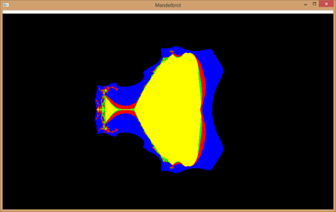
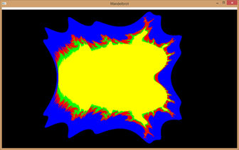
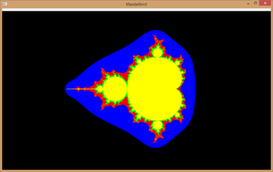
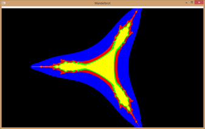

# OpenGL Mandelbrot Set Visualization

## Overview
This project visualizes the Mandelbrot set using OpenGL. The set is rendered with color gradients based on iteration counts to provide a visually appealing representation of complex numbers.

## Features
- **Mandelbrot Set Rendering:** Generates and displays the Mandelbrot set.
- **Color Gradients:** Applies color gradients based on the iteration count to enhance visualization.

## Results
The following images demonstrate different views of the Mandelbrot set:

   
 

## Code Structure
- **main()**: Initializes OpenGL, sets up the window, and starts the main loop.
- **display()**: Renders the Mandelbrot set with color gradients based on iteration counts.
- **reshape()**: Adjusts the viewport and projection matrix when the window is resized.

## Dependencies
- **OpenGL**: 3D rendering library
- **GLUT**: Utility toolkit for OpenGL
- **GLAUX**: Additional utilities for OpenGL
